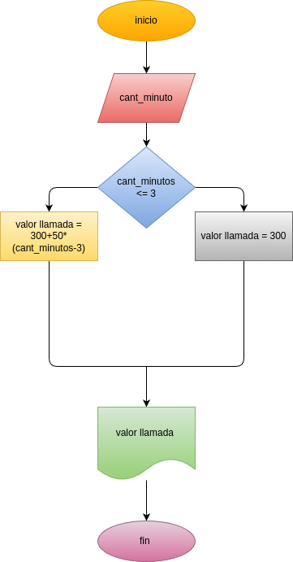

# Condicionales_1
condicionales # 1
## Costo de una llamada telefonica

ingresar el tiempo de una llamada telefonica y determinar la cantidad a pagar:
_ Toda llamada que dure 3 minutos o menos tiene un costo de 300 pesos

_cada minuto adicional cuesta 50 pesos

# Analisis

## Input
### Variables de entrada
cant_minutos: cantidad de minutos en la llamada
### processing
valor _llamada: calcular el valor de llamada 

si es menor o igual a 3 minutos: el valor final ser de 300 pesos

si es mayor a 300 pesos: 300+50*(cant_minutos-3)

### output
costo de la llamada:
# Diseño

# Construcion 